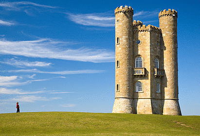

# seam-carver

Basic implementation of content-aware image resizing. Still in progress! This is mostly for run, as Photoshop has an implementation of this called [Content Aware Scaling](https://helpx.adobe.com/photoshop/using/content-aware-scaling.html).

Based on assignments from:

[UC Berkeley](https://inst.eecs.berkeley.edu/~cs194-26/fa14/hw/proj4-seamcarving/index.html), [Princeton](http://www.cs.princeton.edu/courses/archive/spring14/cos226/assignments/seamCarving.html), and [Brown's](http://cs.brown.edu/courses/cs129/results/proj3/taox/) computational image processing courses.

And the always-dependable [wikipedia page](https://en.wikipedia.org/wiki/Seam_carving).

[Original paper](https://inst.eecs.berkeley.edu/~cs194-26/fa14/hw/proj4-seamcarving/imret.pdf) by Shai Avidan and Ariel Shamir.

### Usage
#### Setup

Create and activate a virtualenv.

`pip install -r requirements.txt`

Put the originals of the images you want to work with in the `imgs` directory. Currently only does dual gradient energy. You can manually change it to use the simple energy function, but dual gradient will probably work better.

Eventually going to set up argparse with more options, but for now:

#### Basic

`python seam_carver.py <file to crop> <name for cropped image> <# of pixels to crop off width> <h/v>`

The last option is either h or v, indicating horizontal or vertical resizing. 

Example: "Crop 50 pixels from the width of castle_small.jpg and save as castle_small_crop.jpg"

`python seam_carver.py castle_small.jpg castle_small_crop.jpg 50 h`

#### Save intermediate images

`python seam_carver.py <file to crop> <name for cropped image> <# of pixels to crop> <interval at which to save image>`

Example: "Crop 32 pixels from the height of mountain_icon.jpg and save it as mountain_icon_crop.jpg, and save every other iteration"

`python seam_carver.py mountain_icon.jpg mountain_icon_crop.jpg 32 2 v`

In this example, intermediate images will get saved in a folder called "mountain_icon_crop", and the final image will be saved to the current directory.

### Algorithm Outline

Things that we need to be able to do in order to do a simple content-aware image resize in a single direction. The other direction can be done by rotating the image and shoving it through the exact same steps. 

1. Read in an image
2. Calculate the energy function for the whole image
	1. Calculate the energy of a single pixel, given the values of its neighboring pixels
4. Calculate cumulative energy map and seam paths for image
5. Find the seam of lowest energy
6. Remove seam of lowest energy
7. Repeat 2 through 6 until image is as small as specified
8. Save resized image.

### Notes

* Uses the notation where img[x][y] means img[row][col], which is consistent with numpy arrays, but which is supposedly the opposite of the convention in image processing.
* seam_carver.py cannot run as script as-is in a virtual env because of something simple probably that I just haven't looked up yet.
* Currently only uses dual energy gradient energy function. As you can see in the vertical resizing example, it slowly decapitates the human figure and ends up scoring the grass as important (probably) due to the many small changes in color across the grass. Different energy functions work well with different types of images. First priority at this point is integrating argparse, but after that I'll see about adding more energy function options and masking.

### Dependencies

* To install, you'll need Pip and virtualenv.
* Numpy (installed as part of the SciPy pack) and Pillow (the active fork of PIL). At the moment PIL is just used for file i/o as all of the actual image manipulation is in numpy, but might use it later for other stuff.
* tqdm for progress bar
